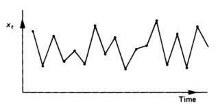

Terminology
===========

General
-------

HVAC(R)
  Heating, Ventilation, and Air Conditioning (and Refridgeration).
  This is the industry that Kaizen is designed to opering within.
  
BAS
  Building Automation System.  The set of control equipment (controllers, sensors, operator 
  workstations, etc) that automated the operation of a building's HVAC equipment.  Often it 
  extends to include the building's Lighting and Access Control equipment.

HVAC Systems:
    HVAC equipment – Air Handlers, VAV units, Boilers, Fan-coils – are called systems.
    Systems may also span (or connect to) multiple pieces of equipment.  
    Examples: the Hot-Water System, the Supply-Air System, the Exhaust System.
    Systems are a means to group sub-sets of data within a building.

Building Automation (BAS)
-------------------------

Trend log
  A series of time-value pairs recording measurements (samples) taken by the building automation system 
  over a period of time. Trend logs (trends, TLs) are the fundamental data structure that allow 
  trend analysis of BAS data.  Trend Analysis is a powerful tool for HVAC troubleshooting. 
  It can detect operating problems, equipment faults, and energy inefficiencies.  Trends are the 
  basis of all of Kaizen's analytics.  Graphically a trend looks like this:
  
.. sidebar:: trend

 | "00:00:00" : 100.0, 
 | "01:00:00" : 100.0,
 | "02:00:00" : 75.0,
 | ...
 | "22:00:00" : 0.0,
 | "23:00:00" : 100.0
 

COV (Change-of-Value) Trend
  A trend log whose samples are recorded only when the source variable (monitored object) changes 
  value by a given amount.  This results in timestamp taken at irregular intervals.  COV Trends are 
  a space saving technique used for values that rarely change, or values that change in occassional 
  bursts.  Most often used to record equipment start/stops, and setpoint changes. 

.. image:: cov_trend.jpg
  
Polled Trend
  A trend log whose samples are recorded at regular intervals (regardless of a change in value).
  Polled trends are most suitable for trend analysis, due to their predicatable time intervals.   
  Most trends are polled.  Typical HVAC time intervals are 5 min, 15 min, and 1 hour.

Analog Trend
  A Trend log whose sample values are integers or floating points (real).  Analog trends may be 
  either COV or Polled.  Polled Analog trends are the most common type of trend logs.
    
Binary Trend
  A Trend log whose sample values are only 0 or 1.  Binary trends may be either COV or Polled. 
  Most often used to record equipment start/stops, and occupied mode. 

.. image:: binary_trend.jpg

Objects (Controller, BACnet, TL)
  Objects are sets of heterogeneous key-value pairs. [BACnet calls them Property-Value pairs.]
  Objects contain meta data (names, units, etc) describing variables (I/O points) in a 
  BAS controller.  There are many types of objects.  The **trend (TL) object** is of special interest 
  to Kaizen as it provides meaning & context to the raw trends.  Every trend has an associated 
  TL Object that describes the trend.
 

Kaizen Specific
---------------

Building
  Kaizen is a multi-tenant application.  To keep the data coming from the many buildings separated, 
  and to prevent user's from seeing data that is not theirs - Kaizen groups the data into logical 
  buildings that mirror the physical buildings from where it came.  Each building is assigned a 
  unique number (location_id) which is used throughout Kaizen to identify data that belongs together.
  
Clients
  Buildings are owned by companies & organizations.  Clients provides a means to group sets of 
  buildings together in a higher-level grouping system.  Clients may own multiple buildings.
  Clients in turn may also be sub-clients of other clients.  Resulting in a heirarchical navigation 
  scheme that closely mirrors the real-world.
  
Delegated Administration
  An abounance of clients & sub-clients leads to a lot of administration.  Delegated Administration 
  is a means to allow administration tasks to be off-loaded (delegated) to sub-clients, 
  in order to reduce (spread) the administration burden. 
  Creates a hierarchy of administrators.

